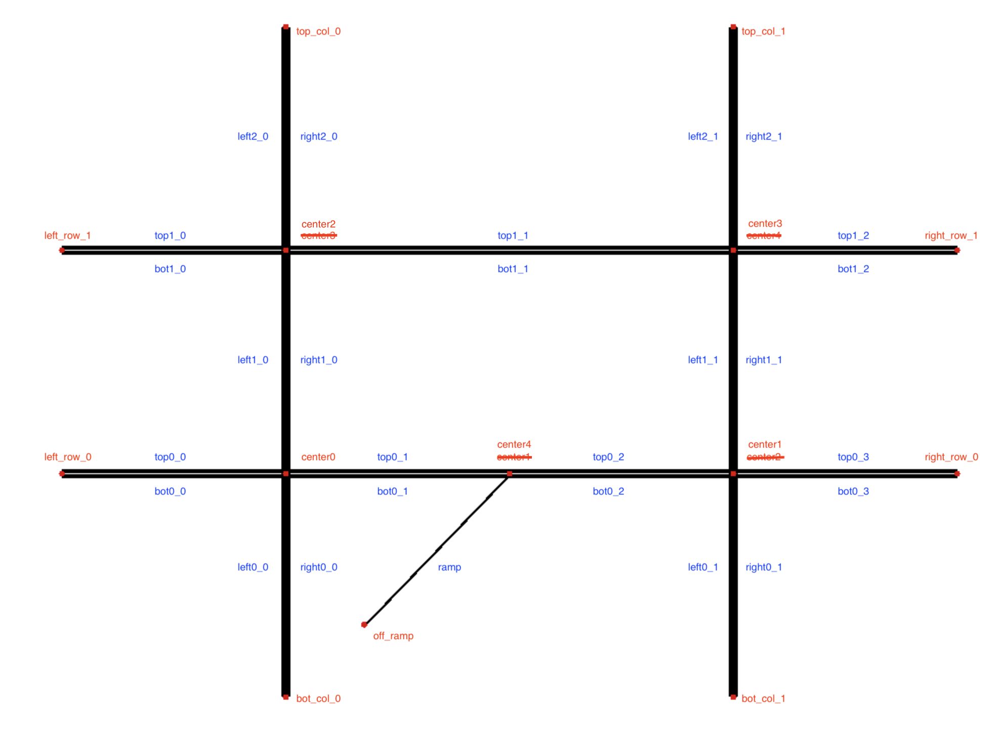

This is the source code of COMP 767 group project of Dingyi Zhuang (ID: 260894334) and Zhenyuan Ma (ID: 260881867). Our topic is about Traffic Light Control in Special Scenario. 

## Simulation Environment
The simulation environment is based on [Berkeley Flow project](https://github.com/flow-project/flow). If you want to implement this code, please follow the installation instruction of Flow.

## Code structure
Our implementation of traffic light control is divided into single- and multi-agent environments. The code structure and containing files are
```bash
├─ project/
│  ├─ network/
│  ├─ tl_custom_env.py
│  ├─ tl_env.py
│  ├─ tl_main.py
│  └─ tl_net.py
│
├─ project_ma/
│  ├─ network/
│  ├─ tl_custom_env.py
│  ├─ tl_custom_env_ma.py
│  ├─ tl_env_ma.py
│  ├─ tl_main_ma.py
│  └─ tl_net_ma.py
│
└─ figs/
```
The suffix *_ma* is for multi-agent, otherwise single-agent. Here are some explanations of the scripts:
- ```tl_custom_env.py``` defines the base class for training RL algorithms in traffic light control scenarios. While ```tl_custom_env_ma.py``` defines the multi-agent training environment for multi-agent RL training.
- ```tl_env*.py``` defines the flow parameters for simulation, developed by [Berkeley Flow project](https://github.com/flow-project/flow).
- ```tl_main*.py``` is the main training script, defines the training algorithms and policy graphs.
- ```tl_net*.py``` defines the traffic network parameters to suit our self-defined scenario.
- ```network/``` contains our self-designed highway ramp special scenario with different infrastructure settings.

## Scenario design

Our special scenario combines the regular crossroads and highway offramp.

## Video instruction

[Watch our video in Youtube](https://youtu.be/wtCUl-WCAj0)

## Data and video sharepoint
Only people in McGill University can access this link!

[RLLib training results](https://mcgill-my.sharepoint.com/:f:/g/personal/dingyi_zhuang_mail_mcgill_ca/EnykH-CLO3ROkNZJOLdyaD4BlFSK35rEK4Z4CGyTYhWv-w?e=FRRNDt)

[Raw simulation video](https://mcgill-my.sharepoint.com/:f:/g/personal/zhenyuan_ma_mail_mcgill_ca/EirwGmvtq_VOsJUgbPVdnhoBuc4j8OjboTuLWCPFVfvK6A?e=5iQvNV)
## Contact
- Dingyi Zhuang (dingyi.zhuang@mail.mcgill.ca)
- Zhenyuan Ma (zhenyuan.ma@mail.mcgill.ca)
